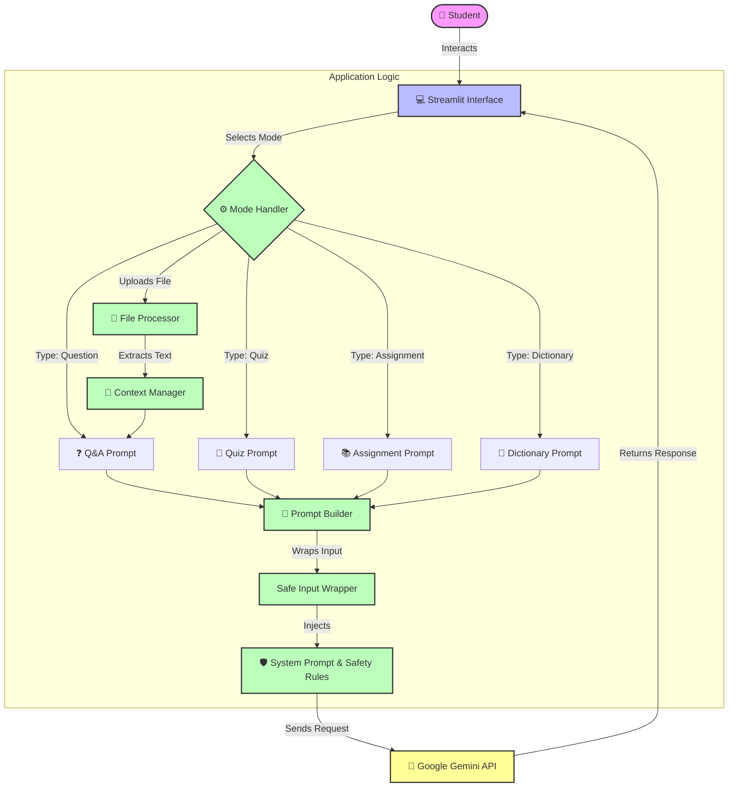

# 🏗️ Edu-Assistant Architecture

This document describes the high-level architecture of the Edu-Assistant application, highlighting how user inputs are processed, sanitized, and sent to the Google Gemini API.

## System Overview

The application is built using **Streamlit** for the frontend and **Google Gemini 2.5 Flash** as the reasoning engine.

### Data Flow Diagram

### Key Components

1.  **Streamlit Interface**: Handles user interaction, file uploads, and displaying chat history.
2.  **Mode Handler**: Routes the request based on the selected mode (Tutor, Quiz, Assignment, etc.).
3.  **File Processor**: Extracts text from uploaded PDF or TXT files using `pypdf`.
4.  **Prompt Builder**: dynamically constructs the prompt based on the mode and user input.
5.  **Safety Layer**: 
    - Wraps user input in XML-like tags (e.g., `<question>...</question>`) to prevent prompt injection.
    - Injects specific safety instructions into the system prompt.
6.  **Google Gemini API**: Processes the final sanitized prompt and returns the educational content.
